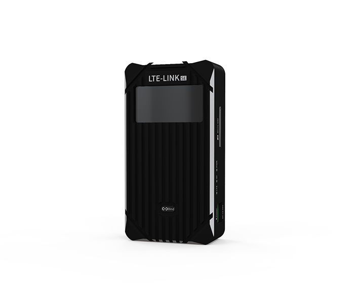

# LTE-LINK series
-----------------

The LTE LINK series communication link is a UAV link, independently supported by CUAV. It supports the integration of drone data and video through an existing 4G or even 5G network (public or private network) for unlimited distance transmission.

There are three versions of the LTE LINK series for different usage scenarios:

* **LTE LINK** ：Full-featured UAV link
* **LTE LINK SE** ： UAV link for the industry market
* **AIR LINK ** ：UAV link to the mass market

## What is the difference?

# Table of content

* [LTE LINK Series](README.md)
   * [LTE LINK](lte-link.md)
   * [LTE LINK SE](lte-link-se.md)
* [Hardware connection](hardware-installation.md)
* [Feigong GS](feigong-gs.md)
  * [installation](feigong-gs/installation.md)
  * [Register an account](feigong-gs/register.md)
  * [Log up](feigong-gs/login-account.md)
  * [Binding and unbinding devices](feigong-gs/binding-and-unbinding.md)
  * [function](feigong-gs/function.md)
    * [Flight Date](feigong-gs/function/flight-data.md)
    * [Flight Plan](feigong-gs/function/flight-plan.md)
    * [All Parameter ](feigong-gs/function/parameter-settings.md)
  * [My](feigong-gs/personal-center.md)
  * [Set up](feigong-gs/application-settings.md)
* [CUAV GS](cuav-gs.md)
* [UAV HUB](uav-hub.md)