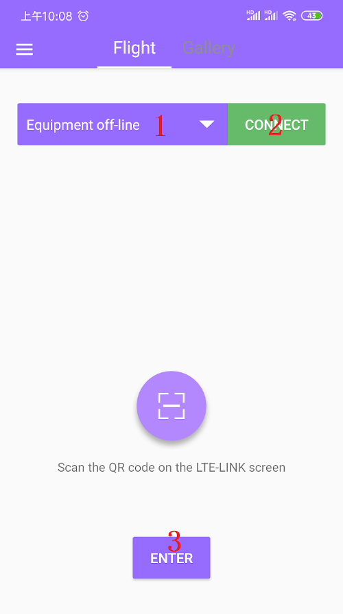

# CUAV GS
---------
CUAV-GS APP is an Android client developed by CUAV for LTE Link series. It has functions such as route planning and equipment management. The following mainly explains how to download and use.

## Download

[CUAV GS](http://fw.cuav.net/apk/CUAV_GS.apk).

> **NOTE**it Support Android 4.0 or higher

## Register an account

Open the CUAV GS homepage, the "Register" button is displayed at the bottom right, click it to enter the registration, fill in the relevant information to register.

## log in

Click the homepage "login" button, enter your account and password to log in.

## Bind device 

After logging in,Click the scan icon to scan the device CID QR code.

>**NOET**After the lte link se is started, press and hold the bind button, a QR code will be displayed; the CID of the AIR link is placed on the side label.
  

    
Follow the prompts to briefly press the Bind key within 15 seconds to complete the binding.

## Unbundling devices / devices renamed 

   

Click on the icon in the upper left corner "My equipment" ,You can delete or rename the device.

## Open flight data and video

   

Select device》 Click to connect》 Click to enter the device

## video

Bind and unbind
https://www.youtube.com/watch?v=P-A8pIhtF_U

Open flight data and video
https://www.youtube.com/watch?v=lU0dKReBmNM

Mission planning
https://youtu.be/wSYaly0C8e8