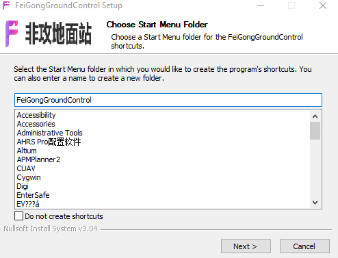
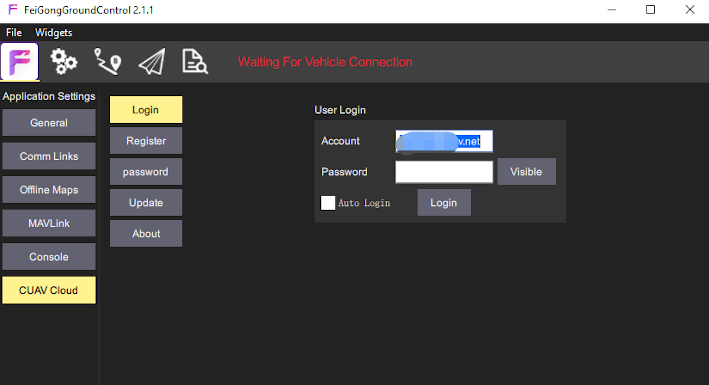

# Feigong GCS
-------------
Feigong GCS is a powerful drone ground control station developed by CUAV for LTE LINK series communication links. It can run under windows system.

It has functions such as flight planning, managing equipment, monitoring drone status, and configuration parameters.

> **NOTE** Feigong v2.0 is based on the QGroundControl ground station, which is similar to the way QGC is used.

You can do the following from Feigong GCS :

* Manage your LTE LINK device
* Remote control of drones by establishing communication with LTE link devices
* Editing a Drone Flight Mission
* Configure your drone parameters to make them work better
* Controlling the gimbal and camera

## Install Feigong {#install-gcs}

> **NOTE** Feigong GCS Support windows7.0 or higher

Download [Feigong GCS](http://fw.cuav.net/apk/feigong_gcs.exe)

Run the installation package program

Click "NEXT" until the installation is complete.

# Features/Screens {#features}

To help you operate Feigong GCS quickly and proficiently, the main function screen of Feigong GCS will be introduced below.

**1.Application**

Application include client settings, COMM links, offlink Maps, MAVLINK, Console, and CUAV Cloud; CUAV Cloud includes operations such as account registration, login, and lte link management.

**2.Settings**

Flight control related parameter settings and status, including sensor calibration, remote control settings, security settings, viewing all parameters, etc.

**3.mission**

Operations related to flight missions, including waypoint editing, surveying and editing, route file saving, etc.

**4.Flight data**

View flight status data, switch flight actions, view videos

**5.Analysis**

Download logs, Mavlink console

**6.Device Selection**

Select the LTE device to be connected

**7.Video definition**

Click this option to change the current video resolution

**8.Decoding**

Contains the current video transmission status, decoding method, and cache method

**9.information**

Client  or drone messages

**10.GPS status**

Display the current GPS accuracy and quantity, click to view the GPS status in detail

**11.Data link signal strength**

Display  status of current data transmission, RSSI parameters of Mavlink

**12.Battery**

Aircraft battery information, including voltage information and current information

**13.Flight mode**

Current flight mode Click this option to switch the flight mode

**14.Armd/Disarmd**

Click this button to unlock / lock the aircraft, you need to slide the prompt box to confirm the operation

## Register CUAV General Account {#register}

If you do not have a universal account for CUAV, you need to register for an account first.
> **NOTE** This account can be used in any client of CUAV (eg feigong GCS, feigong transmission, CUAV GS).One account can bind multiple devices;You can manage all devices connected to this account

Register CUAV General Account

Open Feigong GCS

>** NOTE** You can also register an account using CUAV GS and non-attack transmission.

Click on the 'F' icon in the upper left corner，Click "CUAV Cloud"> select "Register"> enter registration

* Account number is phone number or email
* Password must be 8 or more characters
* Registering an account requires email / mobile phone verification, click the "Get" button on the right to get the verification code.
* Click "Register and Login" to complete the registration and login.

## Log in{#log-in}

Click on the 'F' icon in the upper left corner，Click "CUAV Cloud"> select "log in"> enter registration

## Bind/unbind devices {#bind-and-unbind}

* Open Feigong GCS and login.
  Click the 'F' icon in the upper left corner, and click the "CUAV Cloud"> "Device" button to enter the device management
* For LTE LINK / LTE LINK SE,After system startup is complete ,Press and hold the Bind key until the display shows the QR code,Phone scans the QR code until a string of characters is displayed.
* For AIR LINK，CID is attached to the side of the body。
* Enter the device serial number in the CID box of the terminal and click Bind. Please click the“Bind” button of the device within 15s to confirm the binding.
  > **Note**CID is a unique code for each device. A CID can only be bound to one account, unless you have unbound from the bound account.
  
## Select device

Click“Device Selection”

The ground station will display all the devices bound to the account. The color of the dot symbol on the right side of the device represents the current status of the device (red is offline and green is online). Select the online device and the ground station will establish communication with the device.