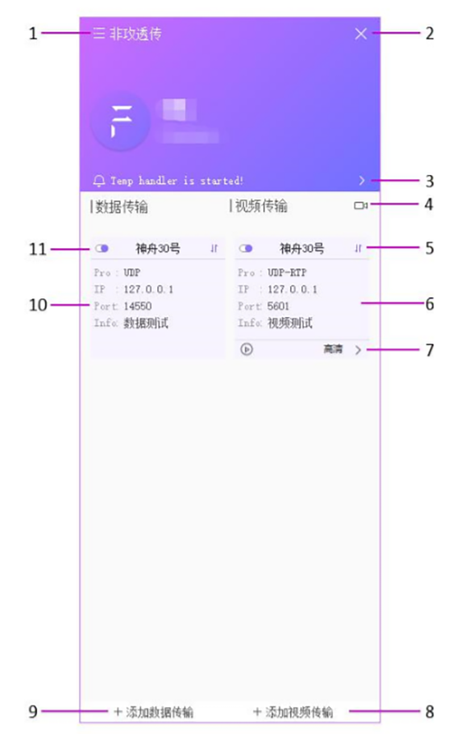

# FeigongTransfer
--------
Feigong transmission can forward the data and video of LTE link to other ground stations. At the same time, it supports independent video display, and supports up to eight channels of video display at the same time. More intuitive monitoring of real-time video footage of multiple drones.

>** Note**It can only send data and video to ground stations within the same local area network.

## download

[Feigong transmission](http://fw.cuav.net/apk/FeiGongTransmission.exe)

## Home screen

**1.Set up** 

It includes device management, personal center, and application. Device management, binding, unbinding, and renaming of devices. The personal center modifies basic personal information. About the application, check the version information and detection updates of the application.

**2.Close the software** 

**3.News**

 You can view all the prompt information of the application.
 
**4.Video screen**

Real-time video display, supports up to 8 video windows.

**5.Data status**

 The data identifier indicates the existence of the forwarded device data. If it is an "x" icon, it indicates that no real-time data is currently obtained, and the data transmission of the device and service needs to be checked.

**6.Video information screen**

 After  building video transmitted, an information screen appears, including the IP, port, device, remarks and other information currently being forwarded.

**7.Video definition**

Current video resolution. Click this option to change the video resolution of the current device.

**8.Add video transfer**

 Click Add Video Transmission, select the corresponding communication protocol, enter the IP and port of the other client, select the device, and confirm the creation of a forwarding message.
 
**9.Add data transfer**

 Click Add Data Transmission, select the corresponding communication protocol, enter the IP and port of the other client, and select the device to confirm the creation of a forwarding message.
 
**10.Data information screen**

 After building date transmitted, an information screen appears, including the IP, port, device, remarks and other information currently being forwarded.
 
**11.Map on/off button**

This button turns on / off the current video and data mapping