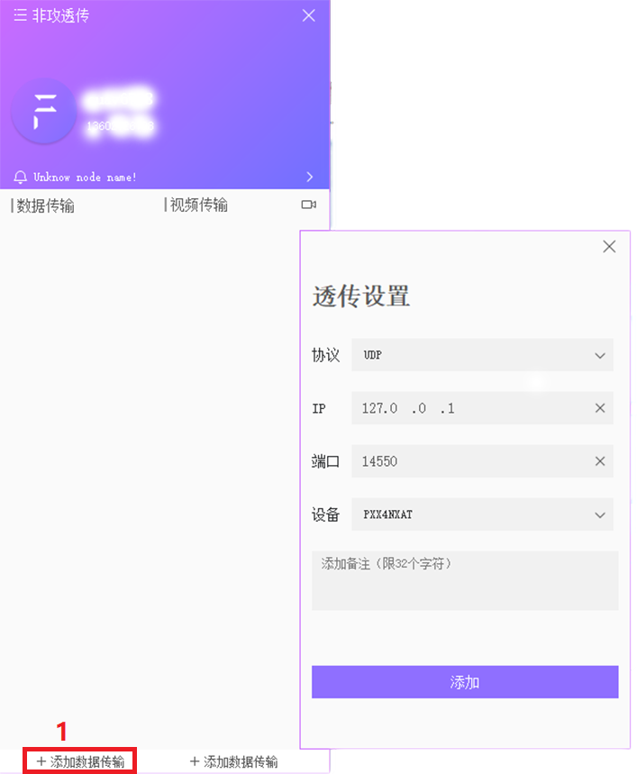
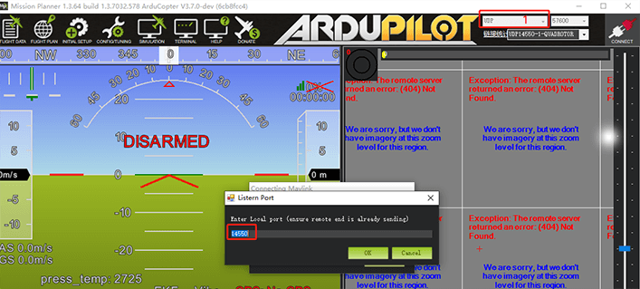

# Building data forwarding

If you need to use a client other than CUAV (such as Mission planner, etc.) to communicate with the LTE LINK series communication link, you need to use Feigong transmission to send video and data to the client you expect.

## How to do？

- Open Feigong transmission and log in to your account
- Click "Add Data Transfer" in the lower left corner to open the data transfer information card
- Protocol is set to UDP
- Enter the destination IP (receiver IP)
- The port is set to 14550
- Select device
- Click"add"

>**NOTE** You can only send data and videos to users on the same LAN. If you send to this machine, you can set the IP to 127.0.0.1; the port number is any value from 1 to 65535. Do not reuse the port number.

## Connect to other ground stations

You can use the computer under this IP to get the drone data. The following uses mssion planner as an example.

- Set UDP port number (consistent with feigong data transmission)

 abut QGroundControl：
QGroundControl has an automatic connection establishment function, and generally does not require you to do anything.