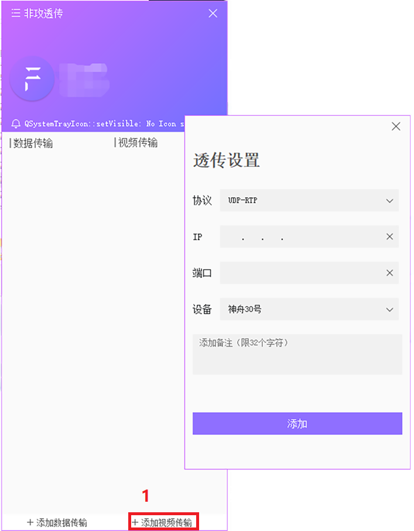
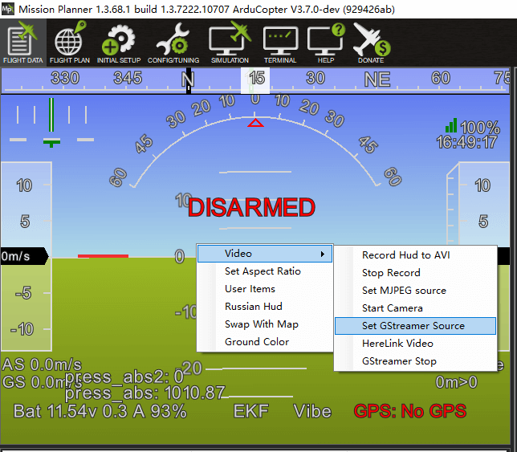
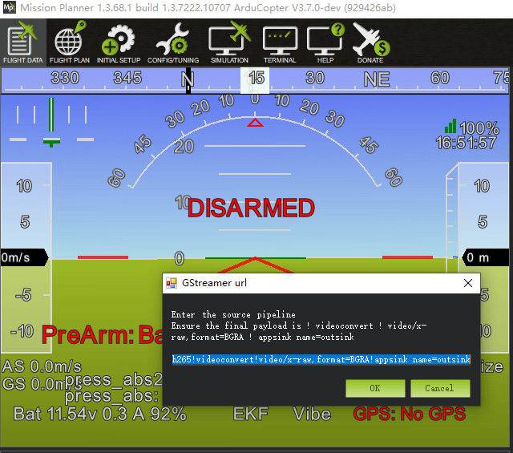
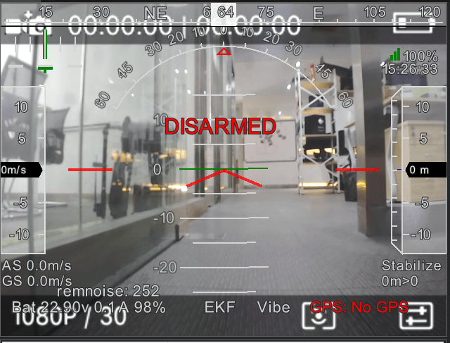

# Building video forwarding

If you need to use a client other than CUAV (such as Mission planner, etc.) to communicate with the LTE LINK series communication link, you need to use Feigong transmission to send video and data to the client you expect.

## How to do?

- Open Feigong transmission and log in to your account
- Click "Add video Transfer" in the lower left corner to open the data transfer information card
- Protocol is set to UDP-RTP
- Enter the destination IP (receiver IP)
- The port is set to 5601
- Select device
- Click"add"

>**NOTE** ou can only send data and videos to users on the same LAN. If you send to this machine, you can set the IP to 127.0.0.1; the port number is any value from 1 to 65535. Do not reuse the port number.

## Connect to other ground stations

You can use the computer under this IP to get the drone data. The following uses mssion planner as an example.

>**NOTE** Mission Planner 1.3.68.1 or higher supports h265 video; it is recommended to set the video quality to "SD / Smooth".

* If your port is set to 5601, the MissionPlanner ground station can automatically detect the video source for display. If the video is displayed for the first time, you will be prompted to install the plug-in. Just click Install. After the installation is complete, restart the MissionPlanner ground station to use the video function normally.

* If using other ports:
Right-click on the HUB interface and select set GStreaner Source

  
  
   Pop-up URL information box:
   If it is RTP transmission, modify the corresponding communication port number and modify port = port number;
For example, if you use port 5600, copy the following information into the message box.
   >udpsrc port=5600 buffer-size=800000 ! application/x-rtp ! rtpjitterbuffer ! rtph265depay ! avdec_h265 ! videoconvert ! video/x-raw,format=BGRA ! appsink name=outsink
   
  
  
  Video analysis may take a few seconds to display, but it does not affect the real-time performance later.
  
  