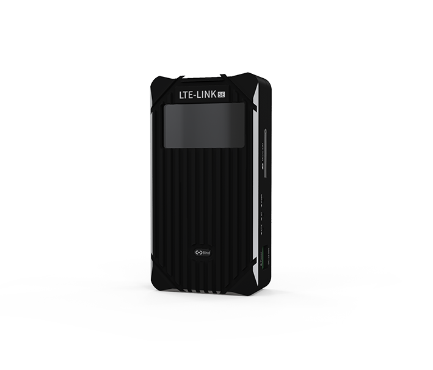
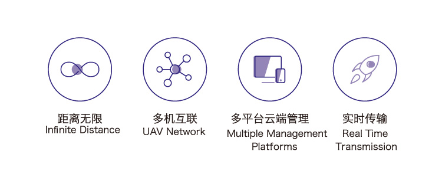
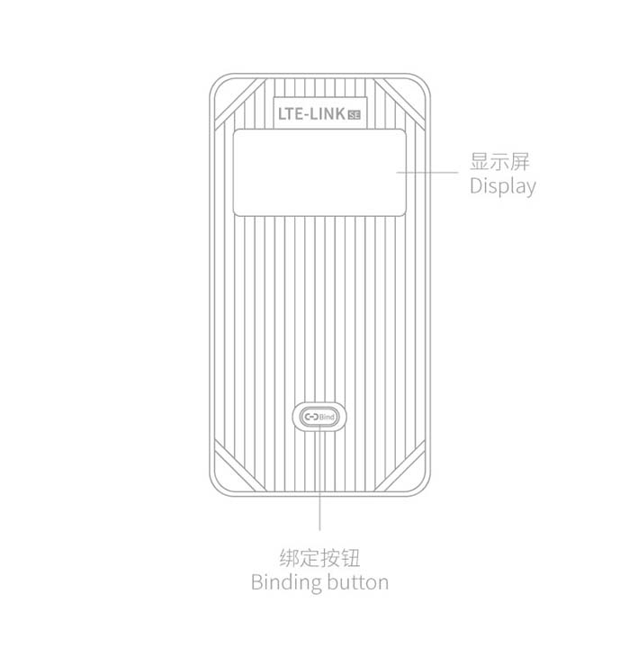
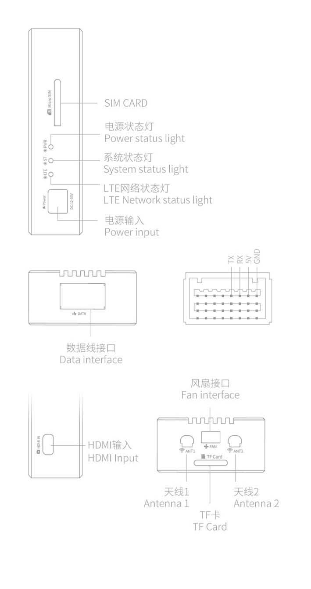

# LTE-LINK SE
-------------

## Overview：

CUAV LTE-LINK se breaks through the traditional point-to-point communication mode of drones. It transmits drone videos and data to ground stations or monitoring centers through LTE(4g) networks.

## key parameter

|   **iTEM** ||
| :--- | :--- |
| processor| HI3516|
|Network card |ME909S*|
| Network frequency band| LTE\(FDD\): B1、B3、B8 |
|| LTE\(TDD\): B38、B39、B40,B41 |
|| DC-HSPA+/HSPA+/HSPA/UMTS: B1、B9、B5、B8、B9 |
|| TD-SCDMA: B34, B39 |
||EDGE/GPRS/GSM: 900/1800MHz |
| Network speed| DC-HSPA+：download 42Mbps;Upload：5.76Mbps |
|| LTE TDD ：download 112Mbps;Upload：10Mbps |
|| LTE FDD ：download 150Mbps;Upload：50Mbps |
| Flight control type| CUAV series、Pixhawk series |
| Data protocol | MAVLINK1、MAVLINK2 |
| Video definition| 1080P（HD)、720P(FD) |
| Video encoding | H265 |
| Network extension| not support |
| Video storage | auto start (default), save to SD card|
| GCS | feigong GCS ：Windowes7 Or higher|
||FeiGong Transmission ：Windowes7 Or higher |
|| CUAV GS ： Android5.0 Or higher|
|| Third Party Ground Station requires  feigong transmission |
|**Working conditions and hardware parameters** |
| Operating Voltage | 10-55V |
| Working current| 12V/1.5A  |
| Operating temperature | -10°~ +60° |
| size | 75.3mm\*39.2mm\*19mm |
| shell material | 6063 Aviation Aluminum |
| Antenna interface type | SMA inner hole |
| Display| OLED  Resolution: 128\*64|
|  | Sport type |
| Video| HDMI|
| Extension ports | UART\*1,TYPE-C USB\*1,Antenna\*3,HDMI IN\*1|

# Sales

[CUAV store](https://store.cuav.net/index.php?id_product=100&rewrite=cuav-4g-lte-link-se-data-and-video-telemetry-&controller=product)

## Sport

## Quick start

[Quick start](quick-start-lte-link.md)

## Ground station

[Feigong GCS(windows)](http://fw.cuav.net/apk/feigong_gcs.exe)

[CUAV GS(Android)](http://fw.cuav.net/apk/CUAV_GS.apk)

[Feigong transmission(windows,It can send data and video to your GCS)](http://fw.cuav.net/apk/FeiGongTransmission.exe)

## More info

[LTE LINK se Users guide](http://manual.cuav.net/lte-link-series/LTE-LINK-SE.pdf)

[LTE LINK se manual](http://www.cuav.net/article/MjAwMjAwMjA0MjIwMjIwWkRJWQ==)