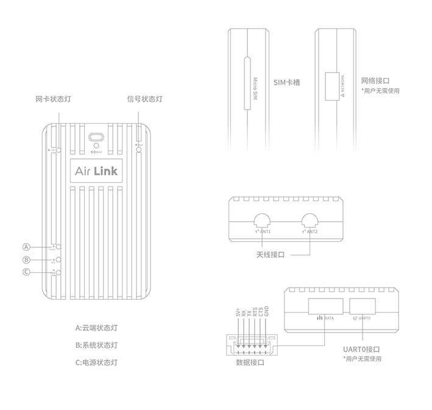

# Air LINK Quick start

---

This article mainly outlines the hardware installation of Air link。

## Connection

Air LINK hardware connection mainly includes antenna, SIM, and flight control.

## SIM Card

## Antenna

## Connect to V5 + / V5 NANO

> **NOTE** Please use dedicated wiring \(the connectors at both ends are green\). One end is connected to the DATA \(AIR LINK\) interface, and the other end is connected to the V5 + flight control TELEM1 / TELEM2 interface.

### Connect to Pixhack

Please use dedicated wiring \(white connector at one end and green connector at one end\). The green connector end is connected to the DATA \(Air Link\) interface, and the white connector end is connected to the Pixhack flight control Radio interface.

## AIR LINK status LED {#led}

**1.Network card status**

* blinks-no network connection 
* Always glowing-network connection is OK. 

> **NOTE** The network cannot be connected, please check the SIM card status and antenna, and the current network environment

**2.**bundling  **status led**

* Off-Device is not account bundling
* Always glowing-Device is not account bundling
* blinks-Device allows binding

**3.Network status**

* Green-Network is good 
* Yellow-Network in general
* Red-Network instability 

**4.Power**

* Light-Power is OK
* Off-No power input

**5.system status**

* Flashes at 1s-System is working

**6.Server status**

* Always glowing-Communication with the server is normal
* off-can not connect to the server

> **NOTE**The cloud server must be connected properly for data communication to be normal.

## Client

- [Feigong GCS](feigong-gs.md)
- [CUAV GS](cuav-gs.md)
- [Feigong transmission](feigong-gs.md)

## More Info

[AIR LINK users guide](http://manual.cuav.net/lte-link-series/Air-Link.pdf)