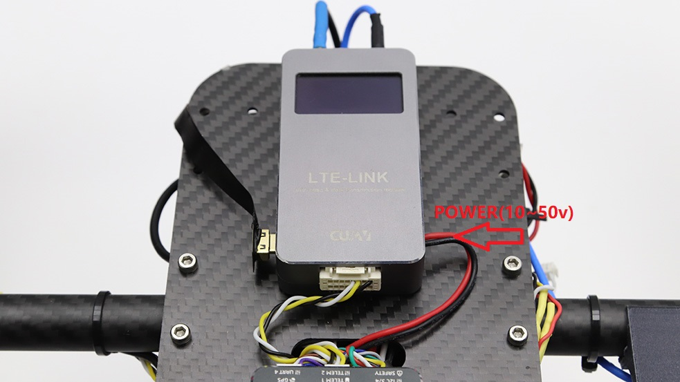
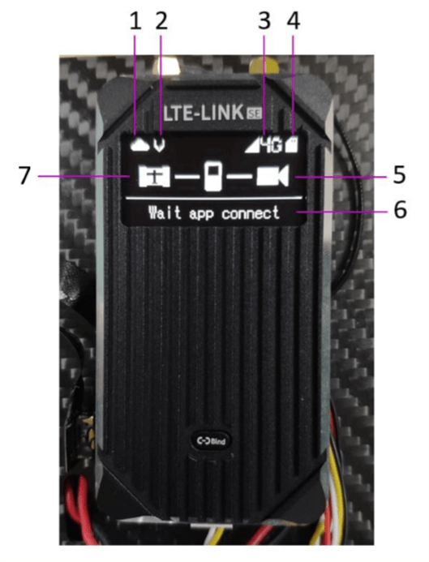

# LTE Link Se Quick Start

 This article will describe the hardware connection of LTE link / LTE link SE

## Hardware connection

> **NOTE** LTE-LINK SE hardware connection is the same as LTE-LINK and will not be introduced separately

## Micro SIM Card

Before using, please check the network frequency bands and network standards supported by the technical parameters and ask the local operator whether the LTE network in the above bands is supported. The LTE LINK uses a micro SIM card; please insert the micro SIM into the LTE port's Micro sim port.

## Micro SD

LTE LINK supports a maximum of 64G SD card (FAT32 format). SD is mainly used to store video. Please insert the SD card into the Micro SD card slot of LTE LINK. 

## Power

LTE-LINK supports 10-50v voltage input. You can directly connect the power cord to the 3 ~ 12s battery to power the LTE-LINK.

## Video Input

>**NOTE** LTE link only supports HDMI video sources.

## Connect Flight Controller

Please insert the data cable into the LTE LINK DBUS interface, and connect the other end to the flight control TELEM1 / RADIO interface (the serial port baud rate is 57600). 

---
## OLED Information{#information}

###  Home screen

**1.Server connection status**
 
The communication status between the device and the cloud server (if the picture has a "\", the connection is disconnected). Connecting to the cloud server is a prerequisite to ensure normal communication between the terminal and the client.

**2.Video transmission**

Light indicates that video transmission is in progress, and hidden means that video transmission is turned off

**3.Network status**

Prompt current network status

**4.SD card**

Whether SD is read

**5.Video input**

Video input status. If the icon has a "\", it means there is no video input.

**6.Device status information**

 * “Devinit”-initialization 
 * “simpppdcall”-SIM card internet dialing in progress 
 * “pppfailed”-Dial failed
 * “Waittimesync”-Wait time synchronization 
 * “connectingserver”-connect to the server 
 * “Waitappconnect”-The network communication is normal and the client can connect.
 * “checkedupdate”-Detect update files. 
 ...... 
 
**7.、Data status**
 
 UART input drone data is normal / off state (need to be MAVlink1 / 2 data)

## Client

- [Feigong GCS](feigong-gs.md)
- [CUAV GS](cuav-gs.md)
- [Feigong transmission](feigong-gs.md)

# Firmware upgrade（SD){#upgrade}

When the device cannot connect to the network, you can use the SD card to update the system version. The SD card flashing steps are described as follows:
* Store valid system firmware files in the SD card root directory. The system firmware file must be named rootfs. If the system firmware file is invalid or the file name does not meet the requirements, the device will not update the system version.
