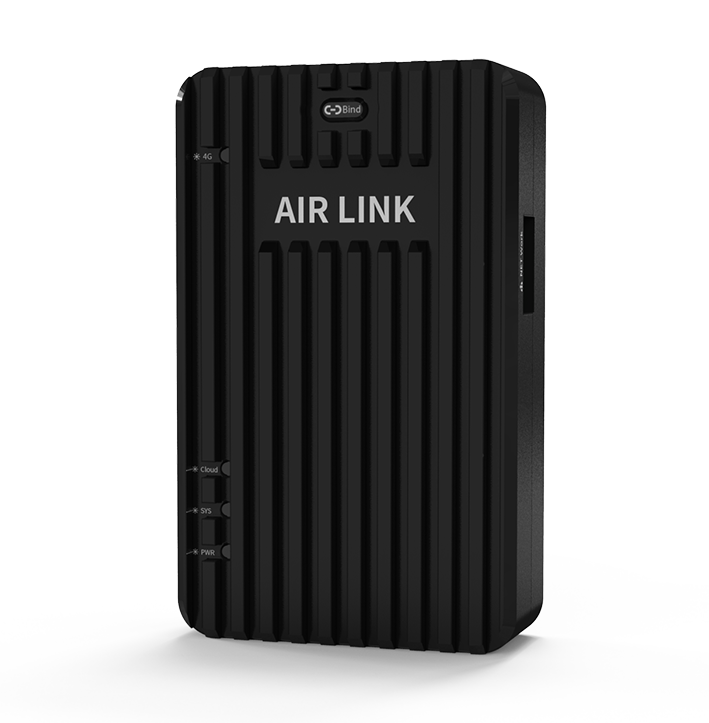
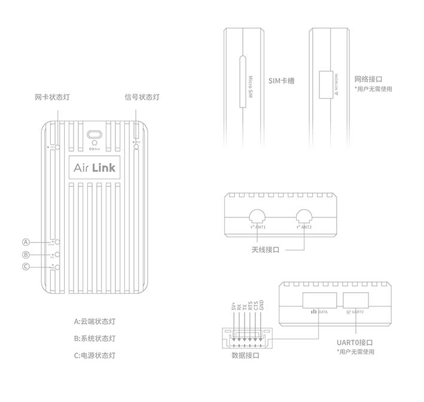

# Air Link数据通信链路
---------------------

### 概述

Air Link是由CUAV独立研发的网络数据通信链路。它依托现有的LTE无线网络（公网或者专网）构建起用户与无人机的数据交互网络，让您时刻掌控无人机的飞行状态。相较于传统的点对点数传，它具有无限距离传输、后台监控、部署便捷等特点。

### 技术参数

|   **技术参数** ||
| :--- | :--- |
| 网络制式 | 电信/移动/联通 4G/3G/2G |
| 4G网络制式| LTE\(FDD\)/LTE\(TDD\)|
| 3G网络制式| TD-SCDMA/WCDMA/CDMA 2000|
| 2G网络制式| EDGE/GPRS/GSM |
| 网络频段 | LTE\(FDD\): B1,B3,B8 | 
||LTE\(TDD\): B38,B39,B40,B41| 
||DC-HSPA+/HSPA+/HSPA/UMTS: B1,B5,B8,B9|
||TD-SCDMA: B34, B39|
||EDGE/GPRS/GSM: 900/1800MHz |
| 网络速率 |DC-HSPA+: 下行:42 Mbps 上行: 5.76 Mbps LTE TDD: 下行:112Mbps 上行: 10Mbps LTE FDD: 下行:150 Mbps上行: 50 Mbps |
| 飞控类型 | CUAV V5系列、Pixhawk系列等 |
| 数据协议 | MAVLINK1/2 |
| 传输距离 | 理论没有限制，视网络覆盖而定 |
| 网络扩展 | 不支持 |
| **接口类型**|
| SIM卡类型| MICRO SIM（单卡）|
| 数据输入| UART |
| 天线接口 | MMCX内孔*2|
| 客户端 | 非攻地面站：Windowes7(含）以上版本|
||非攻透传 ：Windowes7(含）以上版本
|| CUAV GS:安卓5.0含以上版本|
|| 其它第三方客户端以第三方提供的数据为准|
|**工作环境和物理参数** |
| 工作电压 | 5V |
| 工作温度 | -10°~ +60° |
| 尺寸 | 54.5mm\*33.5mm\*13.5mm |
| 重量 | 42g |
|**其它可参考数据**|
|通信延时|视网络环境而定（4G网络并且信号强度较高的情况下平均延时为20-40ms)|
|网络覆盖高度|视地域而定（可参考测试数据为飞行高度为300m以下，数据传输稳定；极限高度（相对高度）为800m+(300M以上高度可能会存在通信中断）|

>**NOTE** 其它可参考数据（通信延时/网络覆盖高度）为测试数据，不同的地域和环境数据差异较大，仅作为参考，不作为产品性能指标。

### 哪里购买？

[CUAV官方旗舰店](https://item.taobao.com/item.htm?spm=a2oq0.12575281.0.0.2fc81debdduS5i&ft=t&id=602838553286)

### 接口

### 快速入门

快速入门请点击[这里](quick-start-air-link.md)

### 软件下载

[客户端软件](http://www.cuav.net/client)

### 更多信息

[AIR LINK说明书](http://manual.cuav.net/lte-link-series/Air-Link.pdf)
[AIR LINK用户手册](http://manual.cuav.net/lte-link-series/Air-Link-User-Guide-v1.0_cn.pdf)