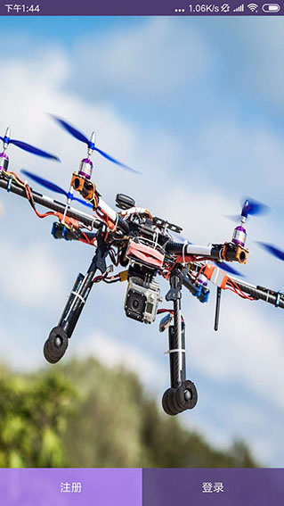
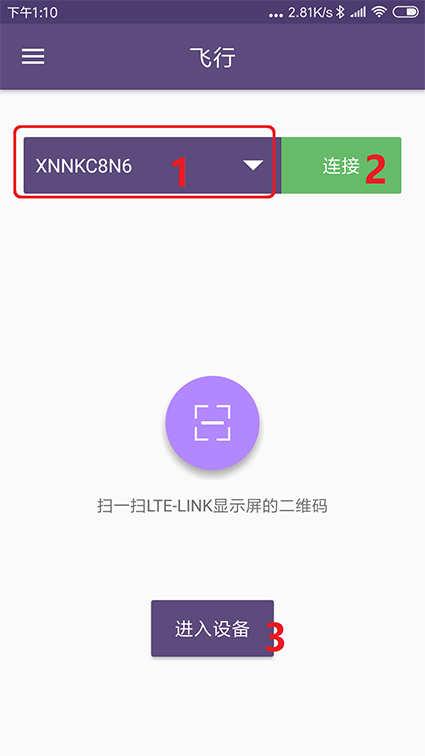

# CUAV-GS手机地面站

---

CUAV-GS APP是CUAV针对LTE Link开发的安卓客户端，它具有航线规划、设备管理、虚拟摇杆等功能。下面主要讲解如何下载和使用。

### 客户端下载

请点击[下载](http://fw.cuav.net/apk/CUAV_GS.apk).
> **NOTE**客户端只支持Android4.0以上版本系统

### 注册账号

点击上图的注册按钮，进入注册界面，填写相关信息注册即可。

### 登录账号

点击首页登录按钮，输入账号和密码登录即可。

### 绑定设备

绑定绑号需先登录账号，然后启动LET-LINK，等待系统启动完成后，长按Bind直至显示屏显示二维码  
点击app上的扫一扫，扫描显示屏上的二维码。  
      
按照提示在15秒内短按一次Bind键,完成绑定。

### 解绑设备/设备重名命

       
点击左上角图标》我的设备》选择设备并向左滑动屏幕，弹出解绑/重命名按键。  

### 进入设备及飞行界面介绍

选择设备》点击连接》点击进入设备
### 更多视频教程

设备绑定和解绑
https://www.youtube.com/watch?v=P-A8pIhtF_U

进入设备和飞行界面介绍
https://www.youtube.com/watch?v=lU0dKReBmNM

航线规划

https://youtu.be/wSYaly0C8e8

### 视频教程无法观看？

[设备绑定和解绑](https://v.youku.com/v_show/id_XNDAwNzU4MjM4NA==.html?spm=a2hzp.8253869.0.0)

[进入设备和飞行界面介绍](http://video.tudou.com/v/XNDAwNzYzNDk0MA==.html?spm=a2hzp.8244740.0.0)

[航线规划](https://v.youku.com/v_show/id_XNDAwNzY1MTcyMA==.html?spm=a2h9p.12366999.app.5~5!2~5~5!2~5~5!2~5!3~5~5~5~5~5~21~22~TR~TD!2~5~5!2~H4~A)

