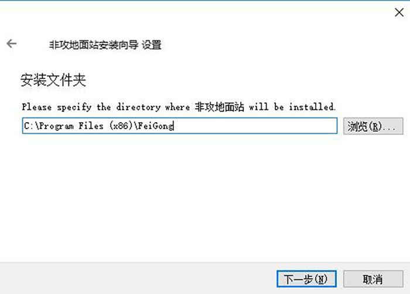
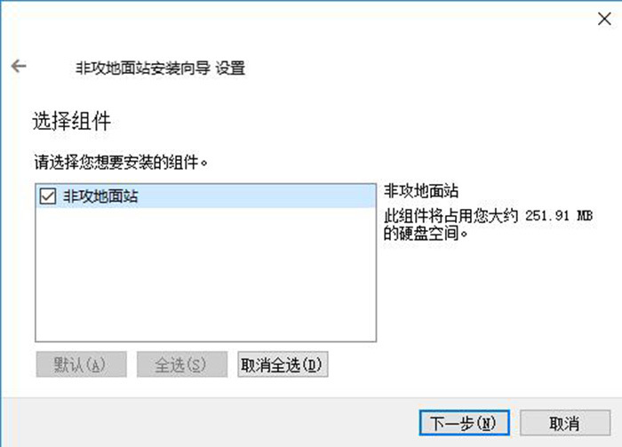
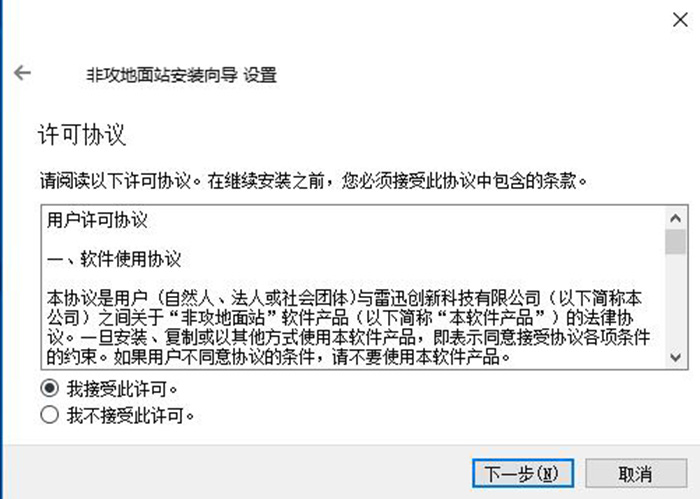
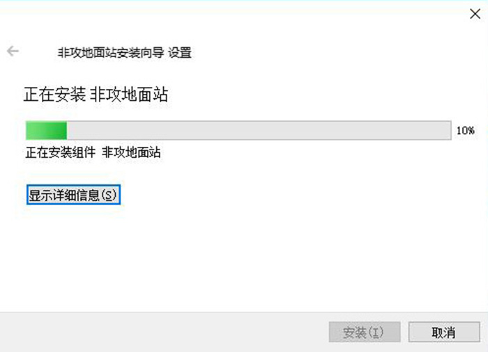
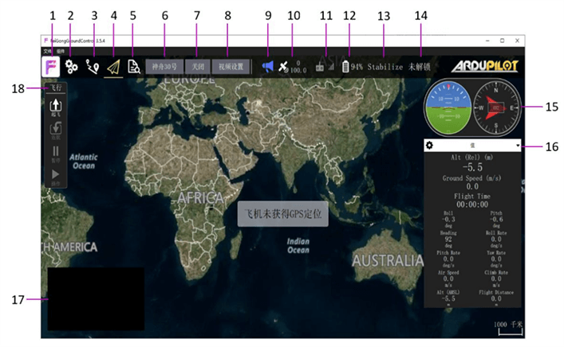

# 非攻地面站
-------------

非攻地面站是CUAV针对LTE LINK系列通信链路开发的强大的无人机地面控制站。它只兼容Windows系统

其具有航线规划、设备管理、无人机监控、参数配置等功能。

>**NOTE** 目前非攻 V2版本系列基于QGroundControl地面站进行开发，在操作风格上尽量保持一致。

您可以通过非攻地面站进行以下操作：

* 管理您的LTE LINK设备
* 通过建立与LTE link设备的通信，实现无人机的控制
* 无人机航线规划
* 无人机参数调试
* 控制云台和相机

## 安装非攻地面站{#安装非攻}

非攻地面站是CUAV针对LTE LINK开发的一款功能强大的PC端地面站；其适用于windows7以上的电脑。

请先下载[非攻地面站安装包](http://fw.cuav.net/apk/feigong_gcs.exe)

下载完成后，请打开程序文件，然后双击运行安装程序。
  

点击下一步

选择安装目录（一般默认即可），点击下一步

点击下一步

选择我接受此许可（选择我不接受许可将退出安装步骤）

点击下一步

点击安装

等待安装完成,
安装完成后即可打开运行。

# 窗口功能介绍{#窗口功能介绍}

---

为了帮助您快速熟练操作非攻地面站，下方将介绍非攻地面站的主要窗口功能。

 

**1.应用设置** 

  应用程序设置包含了客户端内部的所有设置，包含雷迅云的注册、登录、设备管理等操作 
  
**2.飞控设置**

 所有飞控相关的参数设置与状态，包含传感器校准、遥控器设置、安全设置、查看所有参数等操作
  
**3.任务规划**

 飞行任务的相关操作，包含航点编辑、测绘编辑、航线文件保存等操作
 
**4.飞行数据** 

查看飞行状态数据,切换飞行动作,查看视频 

**5.分析界面**
 
日志的下载,Mavlink控制台 

**6.设备选择**

 选择当前所要连接的LTE设备
  
**7.视频质量**

 点击该选项,对当前视频质量进行切换 
 
**8.视频设置**

 查看视频的传输状态 视频解码选择 视频缓存模式选择 
 
**9.信息提示**

 应用和无人机的信息提示
 
**10.GPS状态**

显示当前GPS的精度与数量,点击可详细查看GPS的状态 

**11.数传信号强度**

 显示当前数据传输的信号质量,Mavlink的RSSI参数 
 
**12.电池状态**

显示飞行器的电池信息,包含电压信息 电流信息 

**13.飞行模式**

 显示当前的飞行模式 点击该选项可以进行飞行模式的切换 

**14.解锁/上锁**

 点击此按键,会对飞行器进行解锁/上锁动作,需要滑动提示框确认操作
 
#初次使用
--------
## 注册CUAV通用账号{#注册账号}

第一次使用非攻地面站，请先注册您的CUAV通用账号。该账号可以在非攻地面站、CUAV\_GS、UAV\_HUB等客户端中使用。一个CUAV通用账号可以绑定多台设备，并且可以对绑定的设备进行管理，主账号还可以管理子账号的权限。

下方主要介绍如何注册CUAV通用账号：
  
首先请打开非攻地面站

点击左上角'F'图标，进入应用设置界面，点击“雷迅云”在弹出的界面，选点击“注册”按钮，即可进入注册界面
* 账号为手机号或邮箱
* 密码必须为8位以上任意字符
* 注册账号需要进行邮箱/手机号验证，点击右边“获取”按钮获取验证码
* 点击“注册并登录”完成注册和登录。

  

## 登录CUAV通用账号{#登录账号}

在非攻地面站中登录CUAV通用账号非常简单，点击左上角'F'图标，进入应用设置界面，点击“雷迅云”在弹出的界面，选点击“用户”按钮，即可进入用户管理界面
* 输入账号与密码，点击登录即可（勾选自动登录，下次登录将无需进行手动登录)。

## 绑定/解绑设备{#绑定与解绑设备}

* 请打开非攻地面站并登陆。
点击左上角'F'图标，进入应用设置界面，点击“雷迅云”在弹出的界面，选点击“设备”按钮，即可进入设备管理界面

* 对于LTE LINK/LTE LINK SE,请在系统启动完成后，长按Bind键直至显示屏显示二维码，使用手机微信扫描二维码后会出现一串字符，该字符即为产品序列号（一台设备存在唯一序列号）。
* 对于AIR LINK，请使用微信扫描侧边二维码标签，扫描后会出现一串字符，该字符即为产品序列号（一台设备存在唯一序列号）。
* 在终端CID框处填入设备序列号，点击绑定，请在15s内按一下设备Bind键确认绑定。
>**Note**用户可以通过该设备管理界面，点击对应的设备右边“解绑”按钮即可完成解绑。

## 选择设备

点击“请选择设备”

地面站将显示，该账户下绑定的所有设备，设备右边圆点符号颜色代表该设备当前状态（红色为离线，绿色为在线状态），选择在线设备，地面站将建立与设备的通信。

