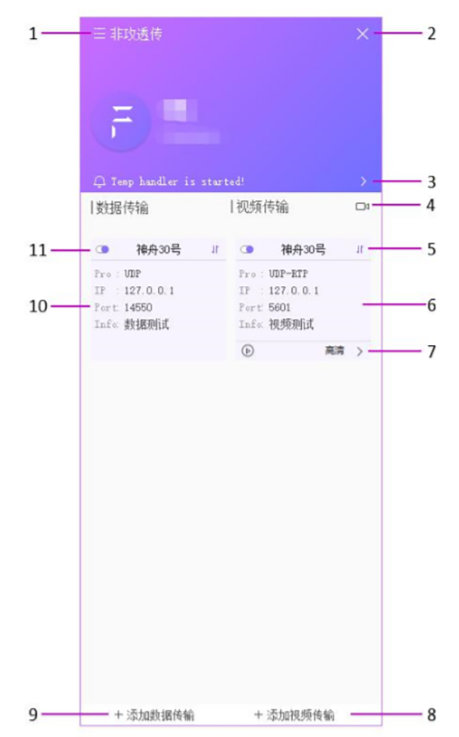

#非攻透传
--------
非攻透传是CUAV为方便用户使用第三方地面站而开发的Windows客户端，用户能够通过非攻透传将设备的数据和视频信息，转发到指定的第三方地面站。应用本身支持独立的视频显示窗口,最大支持8路视频窗口 更直观监控多台无人机实时视频的画面。

>** Note**安装非攻地面站的PC与安装第三方地面站的PC必须处于同一局域网（可以是同一台电脑装载上述两个软件）。

## 下载安装

[非攻透传](http://fw.cuav.net/apk/FeiGongTransmission.exe)

## 主界面

**1.设置界面** 

包含了设备管理、个人中心、关于应用。设备管理，对设备进行绑定、解绑、重命名等操作。个人 中心，对个人的基础信息进行修改。关于应用，查看应用的版本信息与检测更新。 

**2.退到后台** 

点击按键后，应用自动退到后台。可以在后台重新点击显示应用或右键后台图标选择退出。

**3.消息栏**

 可以查看到应用所有的提示信息。
 
**4.视频窗口**

进行实时视频的显示，最大支持8路视频窗口。

**5.数据状态标识**

 该数据标识状态表示转发的设备数据的存在情况。如果是断开图标，表示当前没有获取到实时数据， 需要排查设备的数据输入是否正常，或网络通信是否正常。

**6.视频信息框**

 创建的视频传输都会以信息框的方式显示，信息框显示了当前转发的IP、端口、关联设备、备注等信息。

**7.视频质量复选框**

 显示当前视频质量，点击该选项，可以对信息框关联的设备进行视频质量的切换操作。

**8.添加视频传输**

 点击添加视频传输，选择对应的通信协议，输入对方客户端的IP与端口，选择设备，是否需要添 加备注信息，确认创建一个转发信息。 
 
**9.添加数据传输**

 点击添加数据传输，选择对应的通信协议，输入对方客户端的IP与端口，选择设备，是否需要添 加备注信息，确认创建一个转发信息。
 
**10.数据信息框**

 创建的数据传输都会以信息框的方式显示。信息框显示了当前转发的IP、端口、关联设备、备注等 信息。 
 
**11.转发开启/关闭按钮**

 创建的数据传输与视频传输，都可以通过该按钮开启/关闭当前的传输