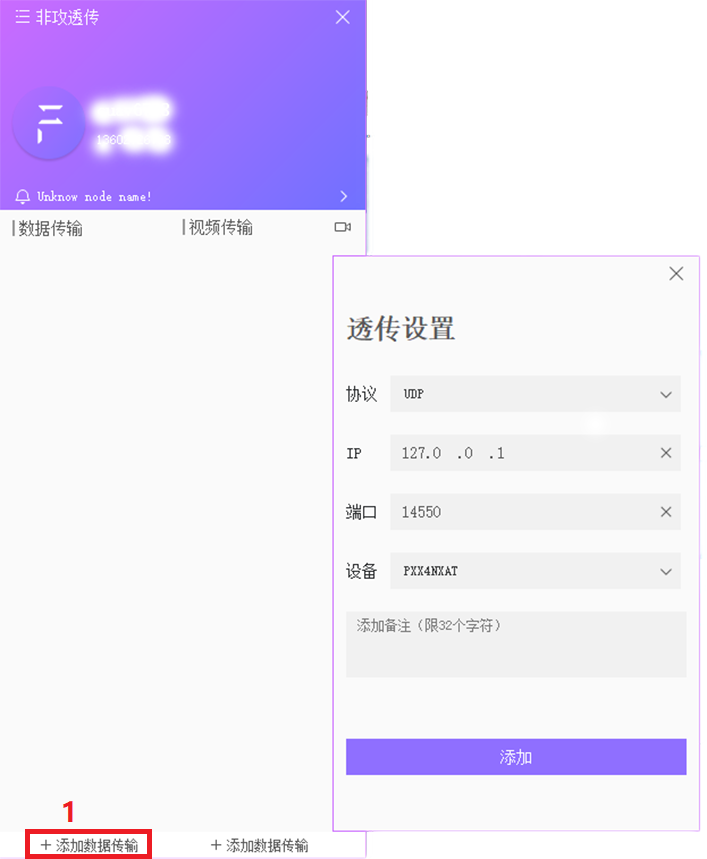

# 创建数据转发

如果您需要使用第三方地面站（如Mission planner等）与LTE LINK系列通信链路进行通信，您需要使用非攻透传进行数据转发。

### 如何创建?

- 打开非攻透传并登录
- 点击左下角“添加数据传输”，打开数据传输信息卡
- 协议选择UDP
- 输入目标IP(接收方IP)
- 端口选择14550
- 选择LTE link终端
- 点击添加即可完成

>**NOTE**接收数据的地面站与非攻透传的网络连接处于同一个局域网内,如是同一电脑IP地址可以直接输入“127.0.0.1”，端口号可以是1-65535内任意数值，建议从14550开始，请勿重复使用同一端口号。

### 连接第三方地面站

创建数据转发后，可以使用接收方电脑进行数据获取，下面以使用Mission Planner为例。

- 选择UDP端口
- 端口号为您设置的端口号

关于使用QGroundControl地面站：
QGroundControl具有自动建立连接功能，一般不需要您进行任何操作。