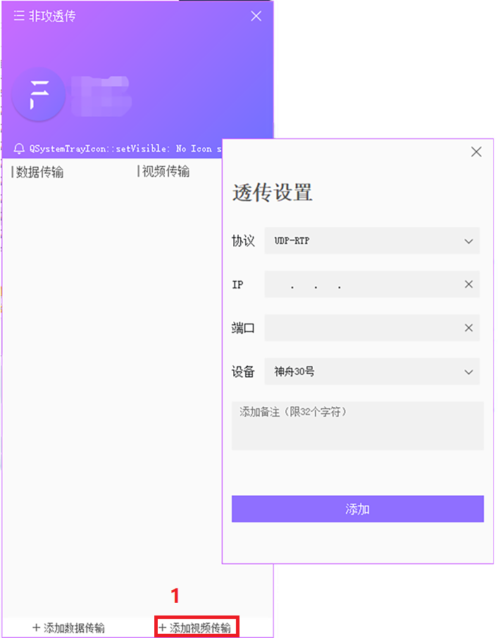
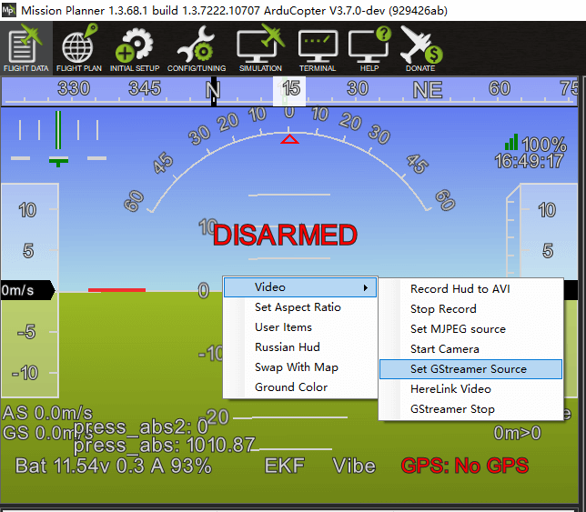

# 创建视频转发

如果您需要使用第三方地面站（如Mission planner等）与LTE LINK系列通信链路进行通信，您需要使用非攻透传进行是视频转发。

### 如何创建?

- 打开非攻透传并登录
- 点击左下角“添加视频传输”，打开视频传输信息卡
- 协议选择UDP-RTP
- 输入目标IP(接收方IP)
- 端口选择5601
- 选择LTE link终端
- 点击添加即可完成

>**NOTE** 接收数据的地面站与非攻透传的网络连接处于同一个局域网内,如是同一电脑IP地址可以直接输入“127.0.0.1”，端口号可以是1-65535内任意数值，推荐使用默认的5601端口，请勿重复使用同一端口号。

### 连接第三方地面站

创建视频转发后，可以使用接收方电脑进行数据获取，下面以使用Mission Planner为例。
>**NOTE** Mission Planner1.3.68.1以上版本支持h265视频；建议将视频质量设置为“标清/流畅”。

* 如果您的端口设置为5601,MissionPlanner地面站可以自动检测视频源进行显示。如果是首次显示视频，会提示安装插件，点击安装即可。安装完成，重启MissionPlanner地面站即可正常使用视频功能。

* 如果使用其他端口:
  在HUB界面单击鼠标右键，选择设置视频源（set GStreaner Source)
  
  
  
   弹出URL信息框:
   如果是RTP传输，修改对应的通信端口号，修改port=端口号;
   例如您使用5600端口，将下列信息复制到信息框内。
   信息：
   udpsrc port=5600 buffer-size=800000 ! application/x-rtp ! rtpjitterbuffer ! rtph265depay ! avdec_h265 ! videoconvert ! video/x-raw,format=BGRA ! appsink name=outsink
   
  
  
  视频解析可能需要等待几秒后显示，但不影响后面的实时性。
  
  