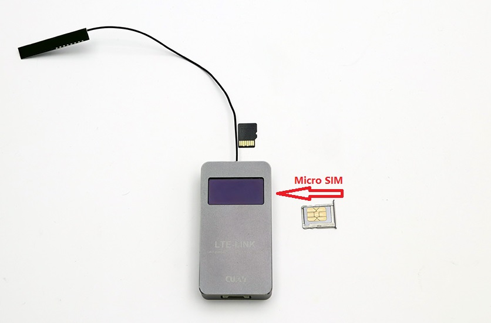
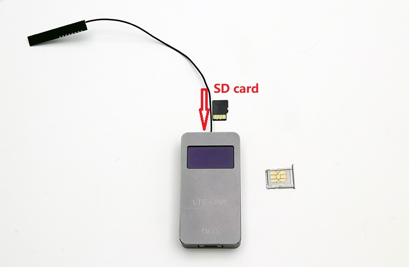
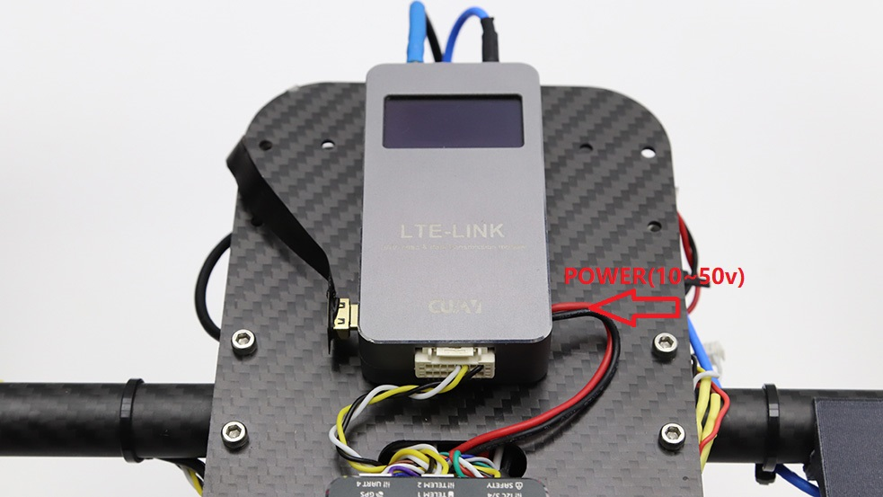
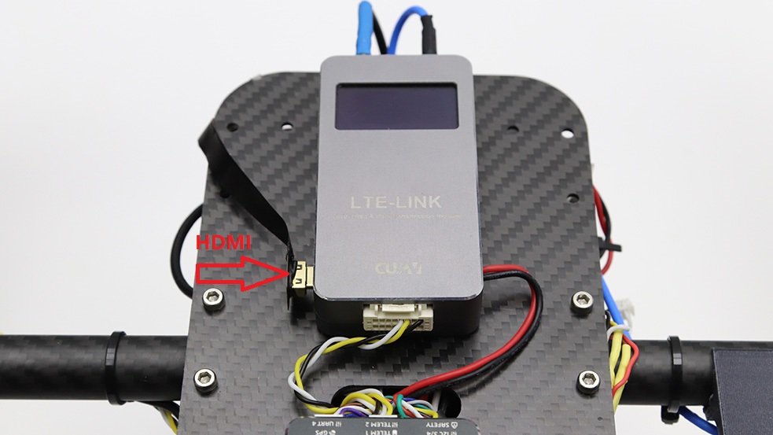
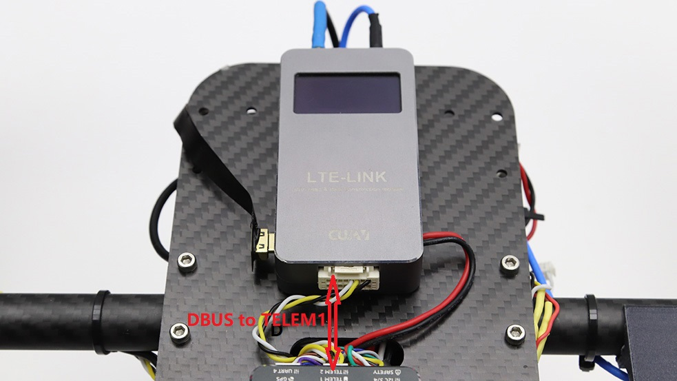

# 硬件安装
---------
使用LTE-link，需要先进行简单的硬件系统搭建。下面主要讲解LTE-LINK的硬件安装。

> **NOTE** LTE-LINK SE硬件连接与LTE-LINK相同，将不再进行单独介绍。

## Micro SIM卡

在中国大陆内，LTE LINK支持中国移动、中国电信、中国联通三大运营商网络；其它国家或地区请查阅技术参数界面支持的网络频段及网络制式并咨询当地运营商是否支持上述频段LTE网络，LTE LINK使用的是Micro SIM卡；请将Micro SIM插入LTE LINK的Micro sim口。

## Micro SD卡（可选）

LTE LINK最大支持64G SD卡（FAT32格式），SD主要用于存储视频。请将SD卡插入LTE LINK的Micro  SD卡槽中。  

## 电源

LTE-LINK内置有降压稳压模块，支持10-50v的电压输入，你可以直接将电源线接入3~12s电池给LTE-LINK供电。

## HDMI视频线

## LTE LINK与飞控连接

请将数据线插入LTE LINK DBUS接口，另外一端接入飞控TELEM1/RADIO接口（串口波特率为57600）。
