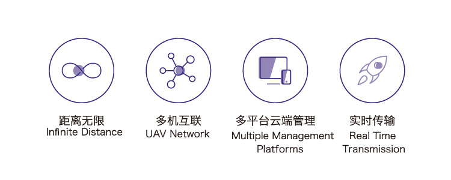

# LTE-LINK SE
-------------

## 概述：

LTE LINK SE是CUAV专为大众市场全新打造的特制版LTE无人机通信链路，它利用了先进的LTE网络（公网或者专网），将数据和视频流融为一体进行无限距离的传输。它不仅是一个无线数字链路，它还是一款先进的无人机通讯系统。它拥有无限互联，云端管理、安全加密、视频录制、多平台客户端等功能。

## 关键参数

|   **整体性能** ||
| :--- | :--- |
|处理器| 海思HI3216|
|网卡|ME909s/ME3630|
| 网络频段 | LTE\(FDD\): B1,B3,B8 | 
||LTE\(TDD\): B39,B40,B41\(38\)| 
||DC-HSPA+/HSPA+/HSPA/UMTS: B1,B9,B5,B8|
||TD-SCDMA: B34, B39|
||EDGE/GPRS/GSM: 1800/900MHz |
| 飞控类型 | CUAV V5系列、Pixhawk系列等 |
| 数据协议 | MAVLINK1/2 |
| 传输距离 | 理论没有限制，视网络覆盖而定 |
| 视频输入 | 1080P、720P |
| 视频编码 | H265  |
| 网络扩展 | 不支持 |
| 云视频存储| 不支持 |
| 视频录制 | 自动录制（默认），存储至SD卡|
| **接口类型**|
| 数据输入| UART |
| 视频输入| HDMI |
| 天线接口 | MMCX|
| 设备屏幕 |OLED 128*64分辨率|
| 客户端 | 非攻地面站：Windowes7(含）以上版本|
||非攻透传 ：Windowes7(含）以上版本
|| CUAV GS:安卓5.0含以上版本|
|| 其它第三方客户端以第三方提供的数据为准|
|**工作环境和物理参数** |
| 工作电压 | 12-55V |
| 工作温度 | -10°~ +60° |
| 尺寸 | 75.3mm\*39.2mm\*19mm |
| 重量 | 78g |

## 哪里购买？

[CUAV旗舰店](https://item.taobao.com/item.htm?spm=a1z10.5-c-s.w4002-21303114052.46.378c2330tLUHpS&id=596686951142)

## 接口

## 快速入门

快速入门请点击[这里](quick-start-lte-link.md)

## 软件下载

[客户端软件](http://www.cuav.net/client)

## 更多信息

[LTE LINK SE说明书](http://manual.cuav.net/lte-link-series/LTE-LINK-SE.pdf)
[LTE LINK SE详细介绍](http://www.cuav.net/article/MjAwMjAwMjA0MjIwMjIwWkRJWQ==)