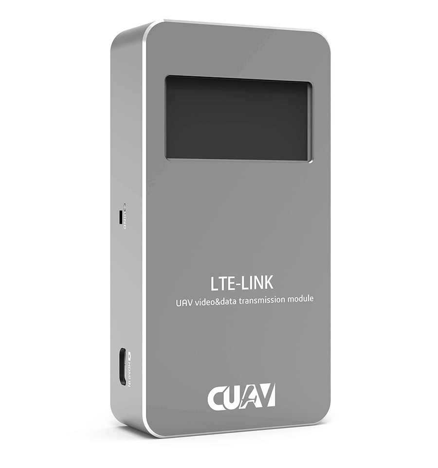

# CUAV LTE-LINK数字高清链路
--------------------------

## 概述：

全新的CUAV LTE-LINK突破传统的传输方式，它利用了先进的4G LTE网络（公网或者专网），将数据和视频流融为一体进行无限距离的传输。它不仅是一个无限数字链路，它还是一款先进的无人机通讯系统。它拥有无限互联，云端管理、安全加密、视频录制、多平台客户端等功能。

## 关键参数

|   **整体性能** ||
| :--- | :--- |
|处理器| 海思HI3216|
|网卡|ME909s/ME3630|
| 网络频段 | LTE\(FDD\): B1、B3、B8 |
|| LTE\(TDD\): B38、B39、B40,B41 |
|| DC-HSPA+/HSPA+/HSPA/UMTS: B1、B9、B5、B8、B9 |
|| TD-SCDMA: B34, B39 |
||EDGE/GPRS/GSM: 900/1800MHz |
| 网络速率| DC-HSPA+：下行42Mbps;上行：5.76Mbps |
|| LTE TDD ：下行112Mbps;上行：10Mbps |
|| LTE FDD ：下行150Mbps;上行：50Mbps |
| 飞控类型 | CUAV系列、Pixhawk系列等 |
| 数据协议 | MAVLINK1、MAVLINK2 |
| 视频输入 | 1080P、720P |
| 视频编码 | H265 |
| 网络扩展 | 支持外置网卡及专网模块（Type C接口） |
| 云视频存储| 不支持 |
| 视频录制 | 需手动开启录制（默认），存储至SD卡|
| 客户端 | 非攻地面站：Windowes7(含）以上版本|
||非攻透传 ：Windowes7(含）以上版本
|| CUAV GS ： 安卓5.0含以上版本|
|| 其它第三方客户端以第三方提供的数据为准|
|**工作环境和物理参数** |
| 工作电压 | 10-55V |
| 工作电流 | 12V/1.5A  MAX |
| 工作温度 | -10°~ +60° |
| 尺寸 | 75 mm  39mm  17mm |
| 外壳材质 | 6063 航空铝 |
| 天线接口类型 | SMA内孔 |
| 屏幕类型 | OLED 自发光 128\*64分辨率 |
|  | 接口类型 |
| 支持相机类型 | HDMI|
| 扩展接口 |RJ45 千兆网口\*1 ,TTL串口\*3,TYPE-C USB\*1,4G天线扩展\*2,HDMI IN\*1|

## 哪里购买？

[CUAV旗舰店](https://item.taobao.com/item.htm?spm=a1z10.5-c-s.w4002-21303114052.67.378c2330tLUHpS&id=575217827691)

[CUAV官方商城](https://store.cuav.net/index.php)

## 快速入门

快速入门请点击[这里](quick-start-lte-link.md)

## 软件下载

[客户端软件](http://www.cuav.net/client)

## 更多信息

[LTE LINK说明书](http://manual.cuav.net/lte-link-series/LTE-LINK.pdf)

[LTE LINK详细介绍](http://www.cuav.net/article/MjAwMjAwMjA0MjIwMjIwWkRJWQ==)