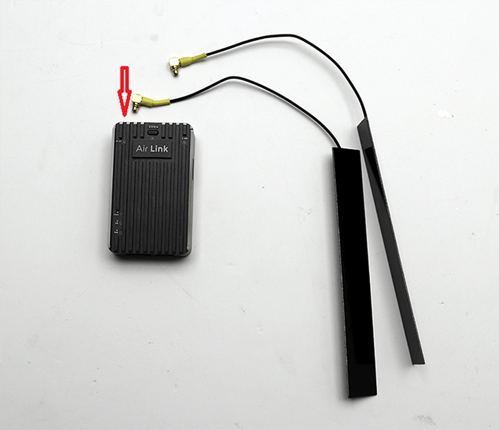

# AIR LINK快速入门
-----------------
本文主要概述Air link的硬件安装

## 硬件安装
Air LINK的硬件安装主要包含天线、SIM、飞控的连接。

### SIM卡

 >**warning** Air link使用MIcro SIM卡，请不要单独将NANO SIM拆除，单独将卡套留在卡托中进行拔插卡托将会导致卡槽损坏；正确的做法应该将整张MIcro SIM卡取出；安装时请注意金属面朝下。
 
### 天线

  

>**NOTE** 两根天线请尽量展开安装。

### 连接到V5+/V5 NANO飞控

>**NOTE** 请使用专用配线（两端连接器皆为绿色）一端接入DATA(AIR LINK)接口，一端接入V5+飞控TELEM1/TELEM2接口（Pixhawk2及以上版本飞控连接方式与V5+相同）。

### 连接到Pixhack飞控

请使用专用配线（一端为白色连接器，一端为绿色连接器）绿色连接器端接入DATA(Air Link)接口，白色连接器端接入Pixhack飞控Radio接口。

### 连接到Pixhawk1飞控

请使用专用配线（一端为DF13连接器，一端为绿色GH1.25连接器）绿色连接器端接入DATA(Air Link)接口，DF13连接器端接入Pixhack飞控Radio接口。

## AIR LINK状态指示灯详解{#状态指示灯详解}

**1.网卡状态灯** 
* 状态灯闪烁-网卡没有网络连接。 
* 状态灯常亮-网卡网络连接正常。 

>**NOTE** 网卡连接不正常，需要排查SIM卡流量或话费，网络信号，天线是否正常。 

**2.绑定状态灯**
* 状态灯常灭-设备没有被绑定。 
* 状态灯常亮-设备已经被绑定。
* 状态灯闪烁-设备允许进行绑定。
 
**3.信号状态灯** 
* 状态灯绿色-网络信号强度很好。 
* 状态灯黄色-网络信号强度一般。 
* 状态灯红色-网络信号强度较差。 

**4.电源状态灯** 

* 状态灯常亮-电源正常。 
* 状态灯常灭-电源异常或没有通电。 

**5.系统状态灯**
* 状态灯1S闪烁-应用程序正常启动。 
*状态灯快闪-飞控数据输入正常。 

**6.云端状态灯** 
* 状态灯常亮-正常连接云服务器。 
* 状态灯常灭-没有连接云服务器。

>**NOTE**必须正常连接云服务器，数据通信才正常。

## 软件入门

[非攻地面站](feigong-gs.md)
[CUAV GS](cuav-gs.md)
[非攻透传](feigong-gs.md)

## 系统还原{#系统还原}

如果设备出现无法正常启动的情况，就要进行设备还原操作，让运行系统还原成最初的版本。 
>**NOTE** 还原成功的版本并不支持数据通信，需要等待进行联网升级，升级完成的版本才可以正常使用。

* 需要长按“Bind”按钮，然后为AirLink设备供电。当设备检测到按键长按超过3s时，信号状态灯亮起蓝色，松开按钮，表示系统进入到还原步骤。
* 还原结束，信号蓝色灯熄灭，设备 自动重启（还原过程中，严禁断电，会导致设备损坏）。

##系统更新{#系统更新}

**系统更新包下载**：
设备会定时获取服务器信息，自动检测是否需要固件更新。如果有最新的版本更新，设 备会自动下载系统更新包。当更新文件正在下载时，AirLink设备的系统状态灯以400ms的频率进行闪烁， 下载结束后恢复系统状态灯先前状态。

>**NOTE** 系统更新包下载过程中，设备仍然保持正常数据传输并不影响无人机与地面站的数据交互。

**系统更新过程**：
当您重启设备后将自动检测是否有系统更新包，如果有系统更新包将进行系统更新，此时信号状态灯亮起蓝色，表示正在进行系统更新。更新完成，系统自动重启。

>**NOTE** 设备在系统更新过程中，严禁断电，否则会导致设备损坏。

## 更多信息

[AIR LINK用户手册](http://manual.cuav.net/lte-link-series/Air-Link.pdf)