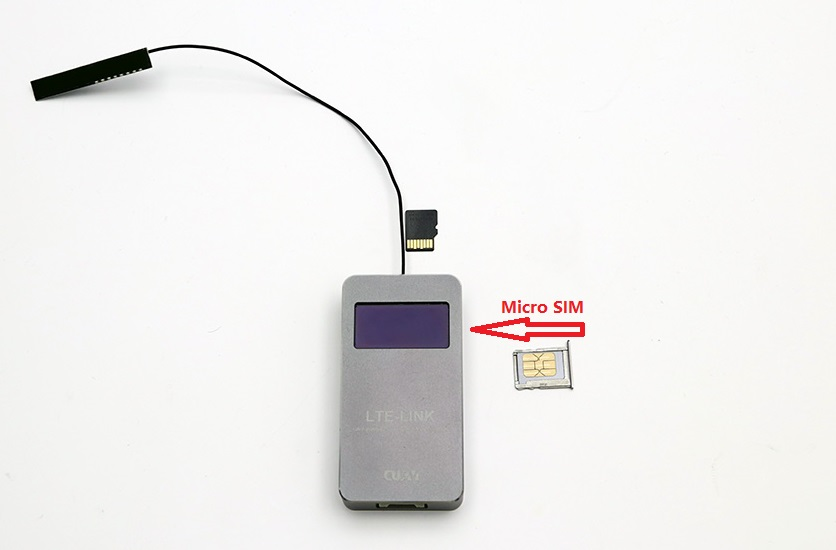
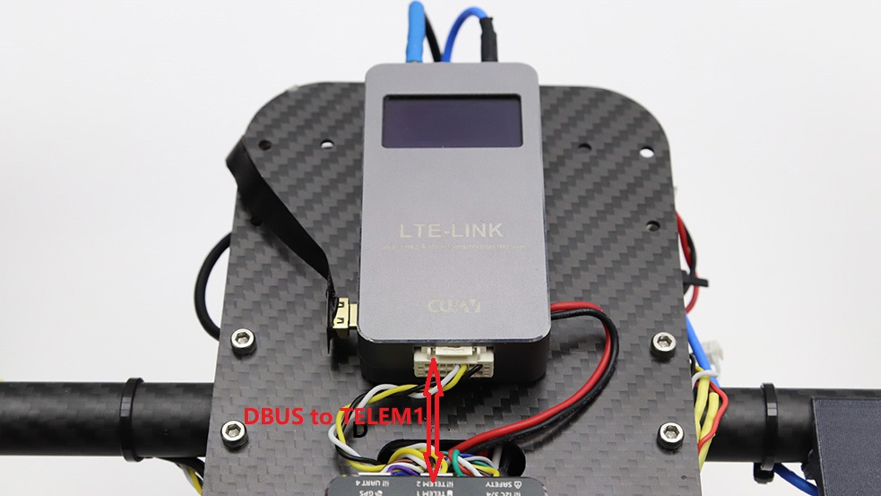

# LTE LINK/LTE LINK SE快速入门

> **NOTE** LTE-LINK SE与LTE-LINK使用教程相同，下面将对两款设备进行快速入门介绍。

## 硬件安装

---

使用LTE-link，需要先进行简单的硬件系统搭建。下面主要讲解LTE-LINK的硬件安装。

> **NOTE** LTE-LINK SE硬件连接与LTE-LINK相同，将不再进行单独介绍。

---

### Micro SIM卡

在中国大陆内，LTE LINK支持中国移动、中国电信、中国联通三大运营商网络；其它国家或地区请查阅技术参数界面支持的网络频段及网络制式并咨询当地运营商是否支持上述频段LTE网络，LTE LINK使用的是Micro SIM卡；请将Micro SIM插入LTE LINK的Micro sim口。

---

### Micro SD卡（可选）

LTE LINK最大支持64G SD卡（FAT32格式），SD主要用于存储视频。请将SD卡插入LTE LINK的Micro  SD卡槽中。  

---

### 电源

LTE-LINK内置有降压稳压模块，支持10-50v的电压输入，你可以直接将电源线接入3~12s电池给LTE-LINK供电。

---

### HDMI视频线

---

### LTE LINK与飞控连接

请将数据线插入LTE LINK DBUS接口，另外一端接入飞控TELEM1/RADIO接口（串口波特率为57600）。

---
## 显示屏提示信息详解{#显示屏提示信息详解}

### 主界面

**1.云连接状态**
 
表示设备是否正常连接到云服务器(该图如带有"\"则为连接断开）。连接云服务器是保证终端与客户端通信正常的前提。

**2.视频传输状态**

显示/隐藏表示当前启动/关闭视频传输

**3.信号状态**

网络信号的强度，网络模式

**4.SD卡状态**

SD卡插入/拔出状态

**5.视频输入**

HDMI输入的视频流正常/关闭状态

**6.设备信息提示**

 设备所有的信息状态提示。
 * “Devinit”-设备初始化。 
 * “simpppdcall”-正在进行SIM卡上网拨号。 
 * “pppfailed”-拨号失败，可以等待一会重新拨号。如果持续失败，需要查看手机卡是不是欠费 或流量不足。 
 * “Waittimesync”-等待时间同步。 
 * “connectingserver”-连接服务器。 
 * “Waitappconnect”-网络通讯正常，客户端可以连接了。
 * “checkedupdate”-检测更新文件。 
 ...... 
 
**7.数据连接状态**
 
 UART输入的无人机数据正常/关闭状态（需为MAVlink1/2数据）。

## 软件入门

[非攻地面站](feigong-gs.md)
[CUAV GS](cuav-gs.md)
[非攻透传](feigong-gs.md)

## 系统还原{#系统还原}

当前系统运行异常时，可根据以下描述步骤还原系统。
**设备还原前准备**
设备还原需要通过网络进行，所以在进行SE设备还原前，需要将有效的SIM卡和天线接到设备上。
**还原步骤**
  * 设备长按按键上电，当设备OLED屏幕上显示“checked restore”信息提示时，表示当前设备进入还原系统模式。
  * 当设备进入还原系统模式，OLED屏幕显示“Flash rootfs”信息时，表示设备正在下载正常运行系统文件，随即等待下载完成
  * 正常运行系统文件下载完毕，设备则会进入自动更新启动过程，此时OLED屏幕提示会由“Flash rootfs”变为“INSIST”如此时等待设备自启动完成即可，还原系统步骤完成后，设备最终会进入到最新的正常运行版本系统。

## 系统升级{系统升级}

固件升级分为两部分，设备软件版本升级和系统版本升级。软件版本升级指升级设备当前运行的软件，系统版本升级指更新设备的整个系统。

### 软件版本升级

设备上电并连接到互联网网络后，会从指定的服务器网址上下载版本更新检索文件，当检索到设备运行的软件有更新版本，设备会自动进行软件升级。
软件升级时，设备OLED屏幕指示的信息以及说明如下：
当SE设备检索到有新版本软件时，设备会将新版本的软件下载设备本身的闪存中，正在下载时，OLED屏幕显示提示信息（load update file)

新版本软件下载完成后，SE设备OLED屏幕上会提示“reboot to update”信息，，当屏幕出现该信息提示时，设备在下一次启动后会自动更新到最新的软件版本。用户可根据OLED上显示的软件版本信息判断当前的软件版本是否已有更新。

### 系统版本升级

网络下载更新：
与软件版本更新相同，设备上电并连接到网络后，设备会从服务器端检索是否存在新版本的系统固件，如果检索到新版本的固件则进行下载更新。
SE设备系统版本下载以及下载结束时OLED提示的信息与软件版本更新提示相同，但在SE设备下一次上电时，系统版本更新OLED屏幕会提示检测更新信息，当设备看到相关信息提示时，等待几分钟系统自动重启后即说明系统版本更新完成。
* 配图说明如下：
当系统版本固件下载完成设备OLED上提示“Reboot to update”信息并手动重启SE设备后，首先检测下载的新版本系统固件有效性。

* 新版本系统固件检测完后，如果新版本固件有效则OLED屏幕提示正在进行根文件系统更新“Flash rootfs”，更新完成后设备自动重启，完成系统版本更新。

# SD卡刷更新：

在设备不能够连接到网络的情况下，可使用SD卡刷进行系统版本的更新，SD卡刷步骤描述如下：
* 将有效的系统固件文件存放到SD卡根目录下，系统固件文件必须命名为rootfs，如系统固件文件无效或文件命名不符合要求，则设备不会进行系统版本更新。
